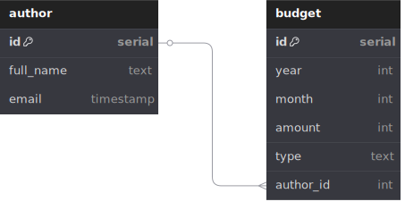

# Budget API Application

 REST API для учета бюджета и формирования отчетов.

### **Основные возможности:**

  * Добавление записей о доходах/расходах;
  * Получение статистики за год;
  * Управление авторами записей;
  * Автоматическая документация через Swagger UI.

### **Стек технологий:**

#### Kotlin 1.5+, Ktor 1.6+, PostgreSQL, Exposed ORM, Flyway (миграции БД), OpenAPI/Swagger

### **Инструкция по сборке**:

1.Установить необходимые инструменты:

    - JDK 11+
    - PostgreSQL 12+
    - Gradle 7+

2.Перейти в корневую директорию проекта.

3.Выполнить команду для сборки проекта:

    - ./gradlew shadowJar

4.Запустить базу данных.

### **Инструкция по запуску**:

Выполнить команду:

    - java -jar build/libs/test-budget-0.0.1-SNAPSHOT-all.jar

### **Использование API**:

После запуска открыть в браузере:

    - http://localhost:8080/swagger-ui/index.html?url=/openapi.json

### **Endpoints:**:

   * POST /author - Создание автора

   * POST /budget/add - Добавление записи бюджета

   * GET /budget/year/{year}/stats - Получение статистики за год

### **ER диаграмма:**

### Список исправлений

1. Тесты работают
   * `testBudgetPagination` - тест показывал ошибки в сервисе, при которых подсчёт total работал только с записями на странице, а необходимо чтоб он брал во внимания все записи запрашиваемого года
   * `testStatsSortOrder` - реализована сортировка выдачи в порядке: сначала по месяцу (возрастание), затем по сумме (убывание)

2. Из модели `BudgetType` через миграцию БД убрано значение `Комиссия`, и заменено на `Расход`

3. Добавлена таблица `Author` - автор внесения записи.
   * 3 колонки - `ID`, `ФИО`, `Дата создания` (дата-время).
   * Добавлен в API метод создания новой записи в `Author`. На вход передается ФИО, дата создания проставляется сервером автоматически.
   * В `BudgetTable` добавлена опциональная привязка по `Author.id`
   * Дополнен `/budget/add` возможностью указать ID автора (опциональное поле)
   * В элементах ответа `/budget/year/{year}/stats` выводится ФИО автора, если он указан для записи, а также время создания записи автора.
   * Добавлен в параметры запроса `/budget/year/{year}/stats` опциональный фильтр по ФИО автора и фильтр по совпадению подстроки с игнорированием регистра.

### Список поставленных ранее задач

1. Починить тесты
  * `testBudgetPagination` - некорректно работает пагинация + неправильно считается общая статистика записей
  * `testStatsSortOrder` - необходимо реализовать сортировку выдачи в указанном порядке

2. Из модели `BudgetType` через миграцию БД убрать значение `Комиссия`, заменив его на `Расход`

3. Добавить таблицу `Author` - автор внесения записи.
   * 3 колонки - `ID`, `ФИО`, `Дата создания` (дата-время). 
   * Добавить в апи метод создания новой записи в `Author`. На вход передается ФИО, дата создания проставляется сервером автоматически.
   * В `BudgetTable` добавить опциональную привязку по `Author.id`
   * Дополнить `/budget/add` возможностью указать ID автора (опциональное поле)
   * В элементах ответа `/budget/year/{year}/stats` выводить ФИО автора, если он указан для записи, а также время создания записи автора.
   * Добавить в параметры запроса `/budget/year/{year}/stats` опциональный фильтр по ФИО автора и фильтровать по совпадению подстроки игнорируя регистр
